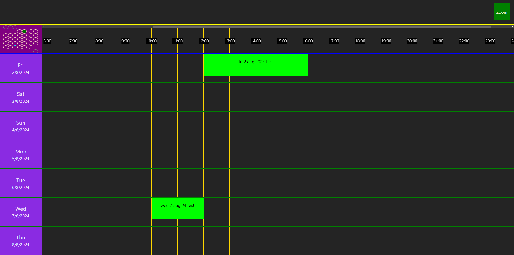

# Calendar Vue

Calendar Vue is a Calendar application built using Vue 3.

My BSc Computer Science dissertation project will be a server-side
event scheduler that uses CalendarVue as its frontend.

<a href="https://youtu.be/bfT5bi0T85c">Video Clip</a>

I intend on creating a simple C# REST API in this project before the start
of my final year.

Features:
- Calendar time map.
- Scroll through days.
- Days are shown with weekday and date.
- Create new events by clicking the time map.
- Edit existing event by clicking it.
- Month view in the top left follows your scroll position and
allow quick jump to a particular day.
- Adjust the zoom of the time map.

The colours / styling is not supposed to look well-developed as
I have been focusing on logic and positioning. I will make it
look nice later.
